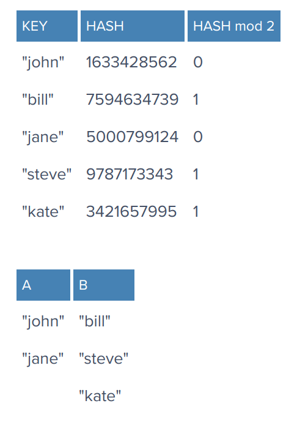
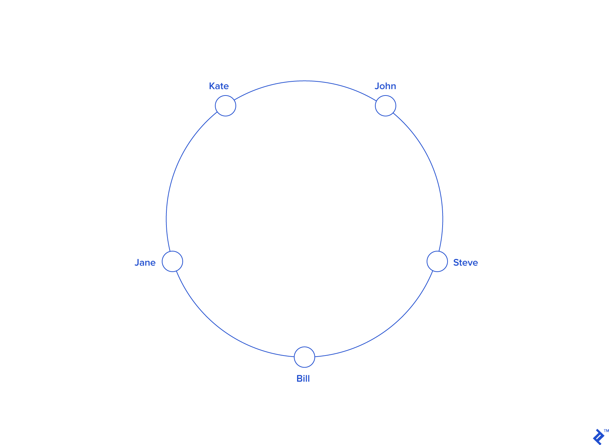
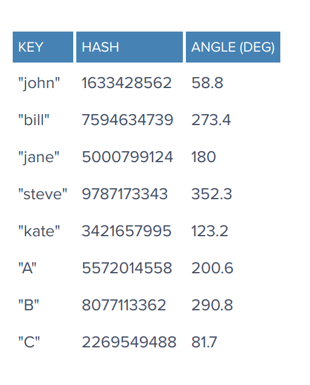

# Consistent hashing #

Consistent hashing is a very useful strategy for distributed caching system and DHTs. It allows distributing data across a cluster in such a way that will minimize reorganization when nodes are added or removed. Hence making system easier to scale up and down.
In consistent hashing when the hash table is resized (e.g. new cache host is added) only `k/n` keys need to be remapped where `k` is the total number of keys and `n` is the total number of servers. Recall that in a caching system using the `mod` as the hash function, all keys need to be remapped.

In consistent hashing objects are remapped to the same host if possible. When a host is removed from the system the objects on that host are shared by other hosts and when a new host is added it takes its share from a few hosts without touching others shares.

The simplest way is to take the hash modulo of the number of servers. That is, `server = hash(key) mod N`, where `N` is the size of the pool. To store or retrieve a key, the client first computes the hash, applies a modulo N operation, and uses the resulting index to contact the appropriate server (probably by using a lookup table of IP addresses). Note that the hash function used for key distribution must be the same one across all clients, but it need not be the same one used internally by the caching servers.

Let’s see an example. Say we have three servers, `A`, `B` and `C`, and we have some string keys with their hashes:

A client wants to retrieve the value for key john. Its `hash modulo 3 is 2`, so it must contact server `C`. The key is not found there, so the client fetches the data from the source and adds it. The pool looks like this:

After the remaining keys are added, the pool looks like this:

This distribution scheme is simple, intuitive, and works fine. That is, until the number of servers changes. What happens if one of the servers crashes or becomes unavailable? Keys need to be redistributed to account for the missing server, of course. The same applies if one or more new servers are added to the pool;keys need to be redistributed to include the new servers. This is true for any distribution scheme, but the problem with our simple modulo distribution is that when the number of servers changes, most hashes modulo `N` will change, so most keys will need to be moved to a different server. So, even if a single server is removed or added, all keys will likely need to be rehashed into a different server.

From our previous example, if we removed server `C`, we’d have to rehash all the keys using `hash modulo 2` instead of `hash modulo 3`, and the new locations for the keys would become:

Note that all key locations changed, not only the ones from server `C`.

We need a distribution scheme that does not depend directly on the number of servers, so that, when adding or removing servers, the number of keys that need to be relocated is minimized. One such scheme—a clever, yet surprisingly simple one—is called consistent hashing, and was first described by Karger et al. at MIT in an academic paper from 1997 (according to Wikipedia).

Imagine we mapped the hash output range onto the edge of a circle. That means that the minimum possible hash value, zero, would correspond to an angle of zero, the maximum possible value (some big integer we’ll call `INT_MAX`) would correspond to an angle of `2𝝅` radians (or 360 degrees), and all other hash values would linearly fit somewhere in between. So, we could take a key, compute its hash, and find out where it lies on the circle’s edge. Assuming an `INT_MAX` of 1010 (for example’s sake), the keys from our previous example would look like this:

Now imagine we also placed the servers on the edge of the circle, by pseudo-randomly assigning them angles too. This should be done in a repeatable way (or at least in such a way that all clients agree on the servers’ angles). `A`convenient way of doing this is by hashing the server name (or IP address, or some ID)—as we’d do with any other key—to come up with its angle.

In our example, things might look like this:

Since we have the keys for both the objects and the servers on the same circle, we may define a simple rule to associate the former with the latter: Each object key will belong in the server whose key is closest, in a counterclockwise direction (or clockwise, depending on the conventions used). In other words, to find out which server to ask for a given key, we need to locate the key on the circle and move in the ascending angle direction until we find a server.

To ensure object keys are evenly distributed among servers, we need to apply a simple trick: To assign not one, but many labels (angles) to each server. So instead of having labels A, B and C, we could have, say, `A0 .. A9`, `B0 .. B9` and `C0 .. C9`, all interspersed along the circle. The factor by which to increase the number of labels (server keys), known as weight, depends on the situation (and may even be different for each server) to adjust the probability of keys ending up on each. For example, if server B were twice as powerful as the rest, it could be assigned twice as many labels, and as a result, it would end up holding twice as many objects (on average).

For our example we’ll assume all three servers have an equal weight of 10 (this works well for three servers, for 10 to 50 servers, a weight in the range 100 to 500 would work better, and bigger pools may need even higher weights):

So, what’s the benefit of all this circle approach? Imagine server `C` is removed. To account for this, we must remove labels `C0 .. C9` from the circle. This results in the object keys formerly adjacent to the deleted labels now being randomly labeled Ax and Bx, reassigning them to servers A and B.

But what happens with the other object keys, the ones that originally belonged in `A` and `B`? Nothing! That’s the beauty of it: The absence of `Cx` labels does not affect those keys in any way. So, removing a server results in its object keys being randomly reassigned to the rest of the servers, leaving all other keys untouched:

Something similar happens if, instead of removing a server, we add one. If we wanted to add server `D` to our example (say, as a replacement for `C`), we would need to add labels `D0 .. D9`. The result would be that roughly one-third of the existing keys (all belonging to `A` or `B`) would be reassigned to `D`, and, again, the rest would stay the same:

This is how consistent hashing solves the rehashing problem.

In general, only `k/N` keys need to be remapped when `k` is the number of keys and `N` is the number of servers (more specifically, the maximum of the initial and final number of servers).
