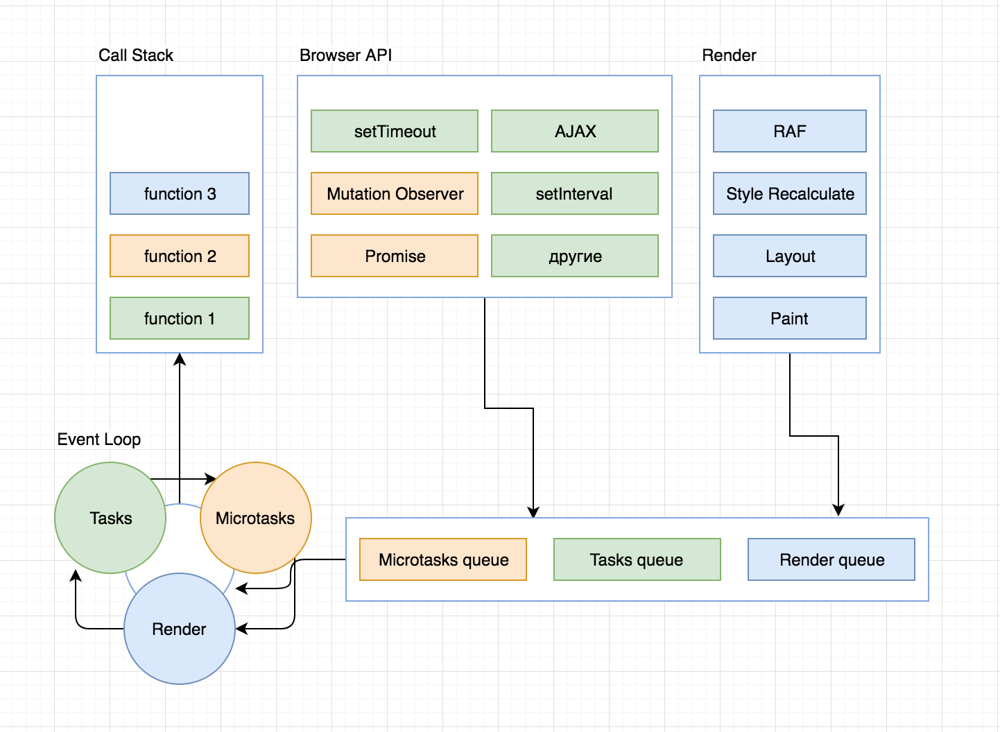

# JavaScript Engine #

A JavaScript engine is a program or an interpreter which executes JavaScript code. A JavaScript engine can be implemented as a standard interpreter, or just-in-time compiler that compiles JavaScript bytecode in some form.

## Structure ##



## Components ##

**Memory heap** - this is where the memory allocation for variable, functions. objects etc. happen
**Call stack** - is a mechanism for an interpreter to keep track of its place in a script that calls multiple functions

## Concurrency & Event Loop ##

JavaScript provides a mechanism to avoid blocking coe via `asynchronous callback` functions, function that does not get executed till later.

E.g. `setTimeout` function.

Right after the `setTimeout` function is executed, engine places `setTimeout`'s callback function into an `Event Table`. `Call stack` tells the `Event Table` to register a particular function to be executed only when a specific event happens

### Event Stack ###

When event does happen, the event table will simply move the function over to the `Event Stack`.

`Event Stack` is an area for functions waiting to be invoked and moved over to the `Call Stack`.

### Event Loop ###

Component that constantly checks whether the `Call Stack` is empty, and whenever it's empty, it checks if the `Event Stack` has any functions waiting to be invoked. If it does, then the first in the queue gets invoked and moved over into the `Call Stack`.

### Tasks and Micro-tasks queue ###

**Tasks** are scheduled so the engine can get from its internals into JavaScript and ensures these actions happen sequentially. Between tasks, the browser may render updates

Examples

- DOM/Web events(onClick, onKeyDown, XMLHttpRequest)
- Timer events: setTimeout(), setInterval()

**Microtasks** are usually scheduled for things that should happen straight after the currently executing script, such as reacting to a batch of actions. The microtask queue is processed after callbacks as long as no other JavaScript is mid-execution, and at the end of each task. Any additional microtasks queued during microtasks are added to the end of the queue and also processed

Examples

- Promises
- Browser observers (Mutation observer, Intersection Observer, Performance Observer, Resize Observer)

## V8 Engine ##

### Code compilation ###

**Bytecode** - is an abstraction of machine code. Compiling bytecode to machine code is easier. Bytecode was designed with the same computational models as the physical CPU.

**Machine code** - runnable on a CPU only with a specific instruction set, while bytecode can be executed in a virtual machine on any CPU that can run the VM

- **Lexical analyzer** (scanner) - takes string of code and split it into a list of tokens e.g `const a = 5` will result in:

```pseudo
  [
    { value: const, type: keyword }
    { value: a, type: identifier }
    { value: 5, type: literal }
  ]
```

- **Syntax analyzer** (parser) - takes a list of tokens and turns it into an AST representation
**AST** - Abstract syntax tree - data structure widely used in compiling due to their property of representing the structure of program code. Each AST node corresponds to an item of a source code

- **Baseline Compiler** - interpreter generates quick (not optimized) bytecode from AST. Code is analyzed and certain objects are marked as hot (used frequently). In runtime hot objects are passed to `optimizing compiler`.

- **Optimizing Compiler** - eventually takes the bytecode and generates optimized machine code from it. 

- **Garbage collectors** job is to go through objects that are allocated in memory and determine whether they are dead or alive. Those that are dead get removed and memory gets allocated back to heap. Newly created objects are allocated super quickly and get scavenged. Once object survive two scavenges they are promoted to `old space`, which gets garbage collected in a separate cycle when full. Garbage collectors (main and secondary) run on a separate thread in a background

Important feature of V8 is `sandbox`. JS functions are sandboxed. They run un isolated executing environments separate from the rest of the code making sure untrusted code cannot harm our environment.
